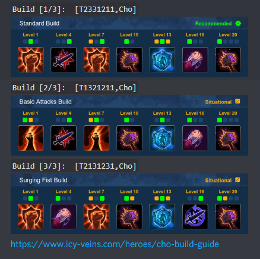

# heroes_bot
A discord.py command bot to render builds from icy veins (Heroes of the Storm) into images.  

  

##Setup
Run `pip install -r requirements.txt`.

Rename `.env-default` to `.env` and paste your discord bot token inside.

Make sure your bot has permissions to:
- Send Messages
- Manage Messages
- Add Reactions
- Embed Links

###Misc
The default command is `?guide <hero name>`. This can be changed in `bot.py`.

`bot.py` is the main script. Run it to start the bot.  
`names.json` is for url resolution and aliases.  
`realnames.txt` is for the help pagination.